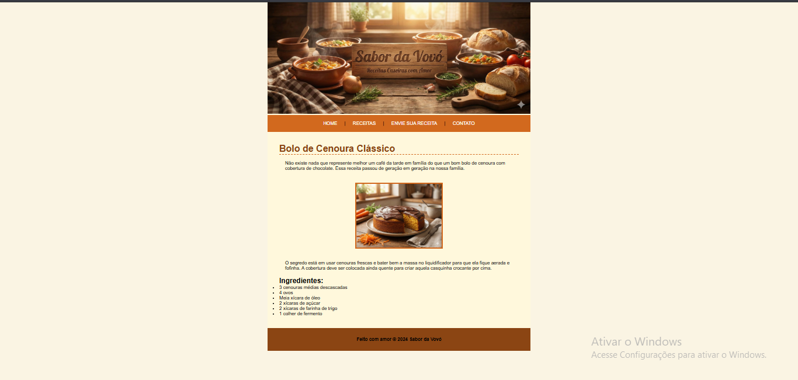

# 🥕 Sabor da Vovó - Receita de Bolo de Cenoura

Este é meu primeiro projeto prático estudando HTML e CSS. O objetivo foi estruturar uma página de receita simples.

## 📸 Resultado

## 🛠️ Tecnologias usadas
* HTML5
* CSS3

## 📚 O que aprendi
* Como usar tags semânticas.
* Como inserir imagens.
* Estrutura básica de CSS.