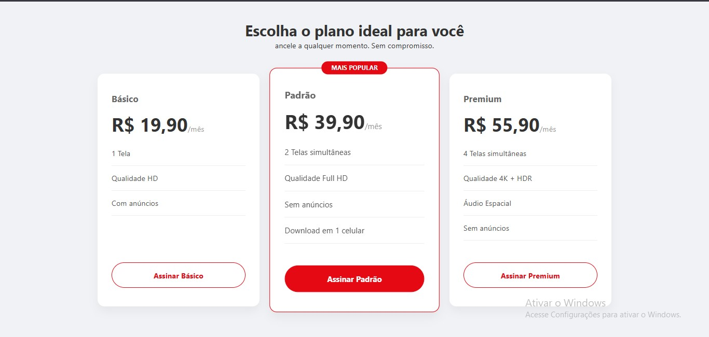

# 🎬 StreamFlix - Tabela de Preços

Este é meu terceiro projeto prático estudando HTML e CSS. O objetivo foi recriar uma tabela de planos moderna e responsiva (estilo Netflix), focando no uso de Grid Layout.

## 📸 Resultado

## 🛠️ Tecnologias usadas

* HTML5

* CSS3

## 📚 O que aprendi

* CSS Grid (criação de colunas com fr)

* Flexbox Avançado (alinhamento interno dos cards e flex-grow)

* Responsividade (@media query para adaptar ao celular)

* Posicionamento (position: absolute para a etiqueta de destaque)

* Efeitos Visuais (transform: scale e box-shadow)